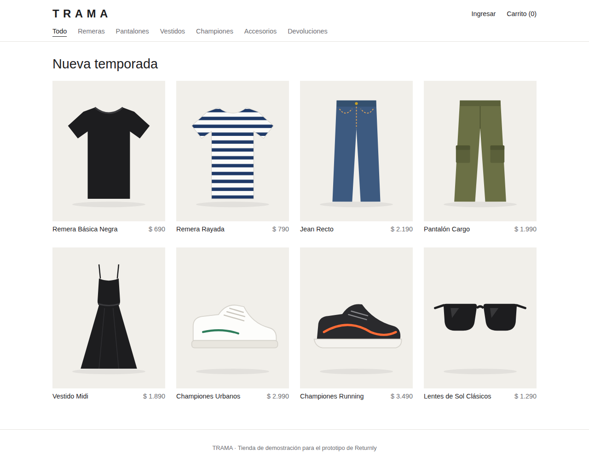

# TRAMA: tienda de ropa de demostración

Tienda e-commerce mínima que simula al "retailer" para el prototipo de Returnly.
Tiene su propia base de datos y expone una API que Returnly usa para consultar pedidos.

- **Frontend:** React + Vite (`frontend/`, puerto 5173)
- **Backend:** Node.js + Express (`backend/`, puerto 3001)
- **Base de datos:** PostgreSQL 16 (Docker, puerto 5433)



## Qué tiene

- Menú por categoría: Remeras, Pantalones, Vestidos, Championes, Accesorios.
- 8 productos (2 remeras, 2 pantalones, 1 vestido, 2 championes, 1 lentes de sol) con talles y colores.
- Carrito (se guarda en el navegador) y checkout sin pago: genera un pedido `TR-####`.
- Cuenta: registro, login y perfil con el historial de pedidos.
- Devoluciones: botón "Solicitar devolución" en cada pedido de los últimos 30 días y página
  "Devoluciones" con número de pedido + email. Ambos mandan al portal de Returnly
  (`VITE_RETURNLY_URL`, por defecto `http://localhost:5174`) con el pedido ya cargado.
- Datos de ejemplo: 20 clientes y 202 pedidos de los últimos 4 meses.

Las imágenes son ilustraciones SVG propias en `frontend/public/img/`; se pueden reemplazar por fotos con el mismo nombre.

## Cómo levantarla

Requisitos: Node 20+ y Docker (o un PostgreSQL propio).

```bash
# 1. Base de datos
docker compose up -d

# 2. Backend
cd backend
cp .env.example .env
npm install
npm run db:reset      # crea las tablas y carga los datos de ejemplo
npm run dev           # http://localhost:3001

# 3. Frontend (otra terminal)
cd frontend
npm install
npm run dev           # http://localhost:5173
```

### Usuarios de prueba

Todos los clientes de ejemplo tienen la contraseña `demo1234`.

| Email | Pedido de demo |
|---|---|
| lucia.fernandez@example.com | TR-1200 (Remera Básica Negra S + Jean Recto 40) |
| martin.rodriguez@example.com | TR-1201 (Championes Running 42 + Lentes de Sol) |

## API para Returnly

Todas estas rutas exigen el header `x-api-key` con el valor de `RETURNLY_API_KEY` (por defecto `clave-demo-returnly`).

| Método | Ruta | Para qué |
|---|---|---|
| GET | `/api/orders?number=TR-1200&email=lucia.fernandez@example.com` | Busca un pedido por número + email y devuelve sus ítems |
| POST | `/api/orders/:number/returns` | Avisa a la tienda que se devolvieron ítems (los marca como devueltos) |
| GET | `/api/sales-summary?desde=2026-06-01&hasta=2026-09-30` | Unidades vendidas por variante, para calcular tasa de devolución |

Ejemplo:

```bash
curl -H "x-api-key: clave-demo-returnly" \
  "http://localhost:3001/api/orders?number=TR-1200&email=lucia.fernandez@example.com"
```

```json
{
  "numero": "TR-1200",
  "fecha": "2026-09-28T00:30:11.835Z",
  "estado": "entregado",
  "cliente": { "nombre": "Lucía Fernández", "email": "lucia.fernandez@example.com" },
  "items": [
    { "id": 383, "sku": "P01-NEG-S", "productoId": 1, "producto": "Remera Básica Negra",
      "categoria": "Remeras", "talle": "S", "color": "Negro", "cantidad": 1,
      "precioUnitario": 690, "devuelto": false }
  ]
}
```

Registrar una devolución en la tienda:

```bash
curl -X POST -H "x-api-key: clave-demo-returnly" -H "Content-Type: application/json" \
  -d '{"email":"lucia.fernandez@example.com","itemIds":[383],"referencia":"RET-0001"}' \
  http://localhost:3001/api/orders/TR-1200/returns
```

Respuestas de error: `401` API key inválida, `404` no existe el pedido con ese número y email,
`400` ítems que no son del pedido, `409` ítems ya devueltos.

## API de la web (interna)

`GET /api/store/products`, `GET /api/store/products/:id`, `POST /api/store/register`, `POST /api/store/login`,
`GET /api/store/me`, `GET /api/store/me/orders`, `POST /api/store/checkout` (estas tres últimas con `Authorization: Bearer <token>`).

## Modelo de datos

`producto` → `variante` (talle, color, sku) · `cliente` → `pedido` → `item_pedido` (con `devuelto` y `devolucion_ref`).
El esquema está en `backend/db/schema.sql`.
